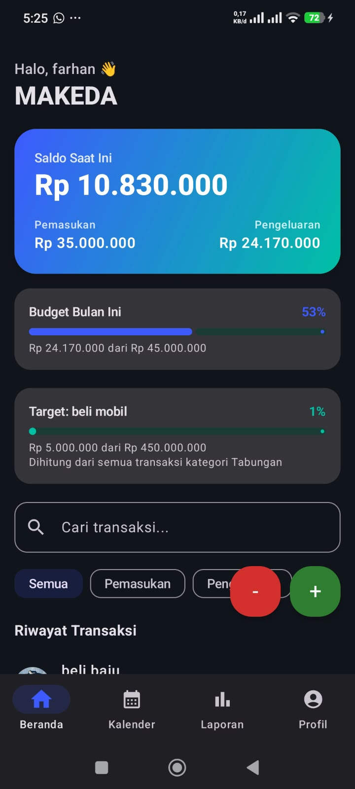
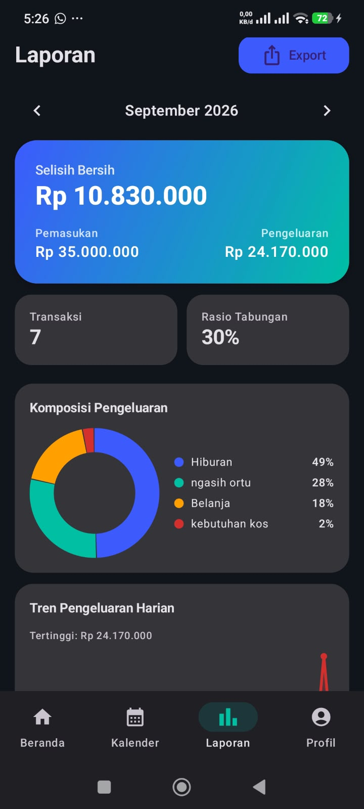
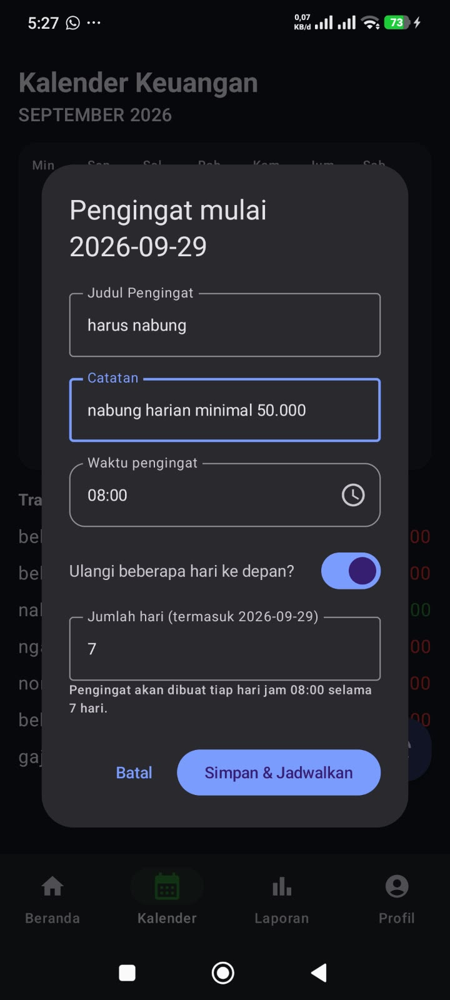
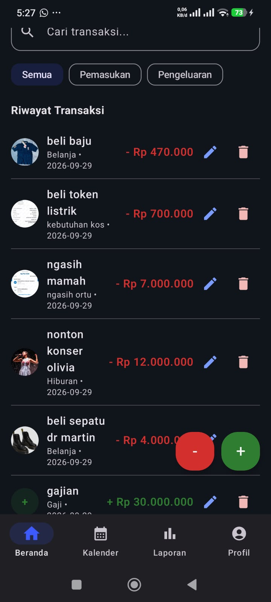

# MAKEDA — Manajemen Keuangan Anda

MAKEDA adalah aplikasi pencatat keuangan pribadi yang membantu kamu mencatat pemasukan dan pengeluaran, mengatur budget per kategori, memantau lewat grafik, serta mengingatkan jadwal keuangan lewat kalender dan notifikasi — semuanya tersimpan langsung di HP tanpa perlu server.

Dibuat oleh **Muhammad Farhan Muzakhi**.

---

## ✨ Fitur

- **Beranda** — catat transaksi pemasukan/pengeluaran lengkap dengan kategori, tanggal, jam (opsional), dan 1-2 foto bukti/struk yang tampil bulat.
- **Budget per kategori** — atur batas bulanan untuk Makanan, Transport, Tagihan, Hiburan, Belanja, dan Lainnya. Notifikasi otomatis muncul saat pemakaian mencapai 80% dan 100%.
- **Laporan** — diagram lingkaran komposisi pengeluaran, grafik tren pengeluaran harian, dan progress bar budget per kategori, per bulan.
- **Kalender & Pengingat** — lihat transaksi per tanggal, tambah pengingat dengan jam analog (jarum bisa digeser), dan bisa dijadwalkan berulang untuk beberapa hari ke depan sekaligus.
- **Pengingat harian menabung** — notifikasi otomatis tiap jam 20.00.
- **Profil** — foto profil, target anggaran bulanan, target tabungan, dan pengaturan budget per kategori.
- **Onboarding** — 3 layar pengantar untuk pengguna baru saat pertama kali membuka aplikasi.
- **Login sederhana** — data tersimpan secara lokal per akun di penyimpanan HP (tidak ada server/cloud).
- Format nominal otomatis berspasi ribuan saat mengetik (mis. `200000` → `200 000`).

## 🛠️ Tools & Teknologi

| Bagian | Teknologi |
|---|---|
| Bahasa | [Kotlin](https://kotlinlang.org/) |
| Framework UI | [Compose Multiplatform](https://www.jetbrains.com/compose-multiplatform/) (Jetpack Compose) |
| Arsitektur | Kotlin Multiplatform (KMP) — kode `commonMain` dipakai bersama Android & iOS |
| IDE | Android Studio |
| Build tool | Gradle (Kotlin DSL) |
| Tanggal & waktu | [kotlinx-datetime](https://github.com/Kotlin/kotlinx-datetime) |
| Concurrency | [kotlinx-coroutines](https://github.com/Kotlin/kotlinx.coroutines) |
| Gambar | [Coil](https://coil-kt.github.io/coil/) |
| Penyimpanan | Local storage per platform (tanpa server) |

**Target platform:** Android (utama, sudah diuji di HP) dan iOS (dukungan kode sudah ada lewat KMP).

## 📱 Struktur Proyek

```
MAKEDA/
├── composeApp/
│   ├── src/
│   │   ├── commonMain/   -> UI & logika bersama (Compose, ViewModel, model data)
│   │   ├── androidMain/  -> implementasi khusus Android (notifikasi, picker, storage)
│   │   └── iosMain/      -> implementasi khusus iOS
│   └── build.gradle.kts
├── gradle/
│   └── libs.versions.toml
└── settings.gradle.kts
```

## 🚀 Menjalankan Proyek

1. Clone repo ini.
2. Buka folder proyek dengan **Android Studio** (versi terbaru, dengan plugin Kotlin Multiplatform).
3. Tunggu Gradle sync selesai.
4. Hubungkan HP Android lewat USB (aktifkan USB debugging) atau gunakan emulator.
5. Pilih konfigurasi run `composeApp`, lalu klik **Run**.

## 📸 Tampilan Aplikasi

| Beranda | Laporan |
|---|---|
|  |  |

| Kalender & Pengingat | Riwayat Transaksi |
|---|---|
|  |  |

## 👤 Kontak

**Muhammad Farhan Muzakhi**
GitHub: [@13-075-muhammadfarhanmuzakhi](https://github.com/13-075-muhammadfarhanmuzakhi)

---

<p align="center">Dibangun dengan Kotlin Multiplatform & Compose Multiplatform </p>
